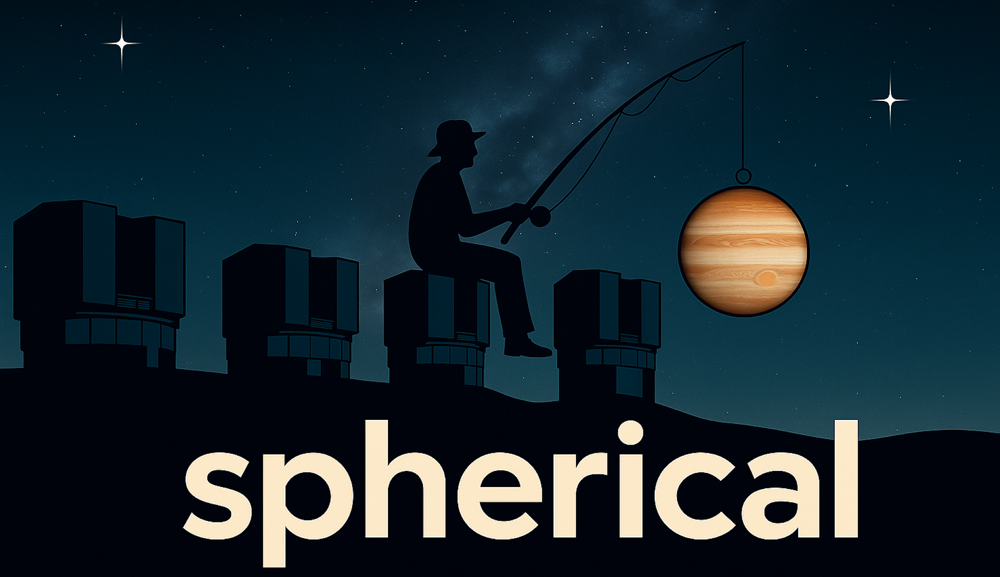

<p align="center">
  
</p>

# spherical: VLT/SPHERE Observation Database and IFS Data Analysis Pipeline

[](https://github.com/m-samland/spherical)
[](https://opensource.org/licenses/BSD-3-Clause)
[](https://github.com/m-samland/spherical/actions/workflows/ci.yml)

**spherical** provides tools for exploring and analyzing data from the ESO VLT/SPHERE instrument, with a focus on high-contrast imaging observations using **IRDIS** and **IFS**.

---

## Overview

**spherical** ships with a **curated observation database**, constructed by parsing headers from all available SPHERE data in the ESO archive and cross-matching with external catalogs. This database systematically identifies SPHERE observation sequences and summarizes observing modes, target properties, integration times, and observing conditions.

From exploration to execution, you can filter sequences of interest and feed them into an **end-to-end IFS pipeline** that automates discovery, download, calibration, post-processing, and spectral characterization. For **IRDIS**, the package supports discovery and download of dual-band imaging (DBI) and polarimetric imaging observations.

> ⚠️ **Note:** The database contains **metadata only**. It does **not** include already reduced data products.

---

## Usage Model

**spherical** is both:

1. **A curated observation database** — metadata about VLT/SPHERE observations in the ESO archive (not the reduced data).
2. **A Python-based IFS reduction and analysis pipeline** — intended to be run from a **Python script** so that you can tune parameters and control each step.

You can use **spherical** in two complementary ways:

- **As a library**  
  Import in Python or Jupyter to query/filter the database and to call pipeline components programmatically.

- **As a script-driven workflow**  
  Start from the provided example script (`ifs_reduction_template.py`) to configure and run a complete IFS reduction with sensible defaults and many tunable parameters.

> ❗ **Why not a one-click CLI pipeline?**  
> The IFS pipeline exposes many parameters (calibration strategy, post-processing choices, masking, spectral extraction options, etc.). A single command-line entry point would hide crucial configuration and often lead to suboptimal results. Instead, we provide a ready-to-run **Python template script** that you adapt to your dataset.

---

## Key Features

- **Comprehensive Database**  
  Auto-generated by parsing all SPHERE headers and cross-referencing with Gaia and other databases to improve completeness and accuracy.

- **Flexible Data Exploration**  
  Identify observations using custom filters (target properties, observing mode, conditions, integration time, etc.).

- **End-to-End IFS Pipeline**  
  Automates:
  - Data discovery and **download** from the ESO archive
  - Spectral cube extraction using the adapted **CHARIS** pipeline ([Samland et al. 2022](https://ui.adsabs.harvard.edu/abs/2022A%26A...668A..84S/abstract))
  - Astrometric and photometric calibration with **A. Vigan’s SPHERE tools** ([repository](https://github.com/avigan/SPHERE))
  - Post-processing with the **TRAP** algorithm ([Samland et al. 2021](https://ui.adsabs.harvard.edu/abs/2017AJ....154....7G/abstract))
  - Automatic detection and extraction of exoplanet **contrast spectra**

- **IRDIS Support**  
  Database discovery and download for **DBI** and **polarimetric** observations.

---

## Installation

**Python ≥ 3.11** is required. We recommend a dedicated environment (e.g., via Miniconda or Micromamba):

```bash
mamba create -n spherical_env python=3.12
mamba activate spherical_env
```

### Base installation (database exploration only)

```bash
pip install git+https://github.com/m-samland/spherical.git
```

> **Database tables required**  
> The SPHERE database tables must be downloaded separately from **Zenodo**: [10.5281/zenodo.15147730](https://doi.org/10.5281/zenodo.15147730).  
> You need both **`table_of_files`** and **`table_of_observation`** for your chosen instrument.

### Full pipeline installation (including IFS reduction)

Due to a dependency on **Ray**, the full IFS pipeline currently supports **Python < 3.13**.

```bash
pip install ".[pipeline]"
```

### Example notebooks

```bash
pip install ".[notebook]"
```

### Testing

```bash
pip install ".[pipeline,test]"
```

> The IFS pipeline is **not** exposed as a one-click CLI tool; run it via the provided Python template script (see Quick Start).

---

## Quick Start

1. **Get the database tables**  
   Download from Zenodo: [10.5281/zenodo.15147730](https://doi.org/10.5281/zenodo.15147730)  
   Place the relevant `table_of_files` and `table_of_observation` files for **IFS** or **IRDIS** where your scripts can access them.

2. **Explore observations**  
   Launch the Jupyter notebook `explore_database.ipynb` to browse and filter available observations.

3. **Run the IFS pipeline (script-driven)**  
   The pipeline is designed to be run from a Python script so you can tune parameters. Modify, then run using:

   ```bash
   python ifs_reduction_template.py
   ```

4. **(Optional) Regenerate / update the database**  
   If you want to rebuild or refresh the tables against newer ESO data, modify and run:

   ```bash
   python generate_database.py
   ```

---

## Scripts

When you install **spherical**, a small set of **helper command-line scripts** are installed and added to your `$PATH`.  
These **do not** run the IFS pipeline itself. Instead, they help **monitor and summarize** pipeline runs you executed via Python scripts:

- **Crash-report aggregator (`crash_reports`)**  
  Collects crash reports from all reductions in the working directory into a single summary for easier debugging.

- **Reduction-status summary (`reduction_status`)**  
  Reports which pipeline steps have been executed for each dataset and their success/completeness status.

### Usage Examples

```bash
# Generate crash report summary
crash_reports /path/to/reductions [--csv crashes.csv] [--top N]

# Generate reduction status summary
reduction_status /path/to/reductions [--csv summary.csv]
```

> Run any script with `--help` to see its options.

---

## Documentation and Examples

Practical usage examples are included:

- **`generate_database.py`** — Generate or update the SPHERE observation tables.
- **`explore_database.ipynb`** — Interactively explore and filter the database.
- **`ifs_reduction_template.py`** — Script template to automate IFS download, reduction, and planet characterization.

> More detailed documentation is planned for future releases. In the meantime, the example script and notebook are the best starting points.

---

## Testing

**Database testing**  
The database-generation logic is covered by unit tests executed via GitHub Actions (see CI badge above).

**Pipeline testing**  
Because the IFS pipeline is computationally intensive and operates on large files, we do not currently run it in CI. To test locally:

1. Install the **full pipeline** (see [Installation](#installation)).
2. Obtain a **small IFS test dataset** (from the ESO archive or your own subset).
3. Run the example reduction:

   ```bash
   python ifs_reduction_template.py
   ```

4. Inspect the outputs (logs, intermediate products, and final results).

> We plan to provide a minimal public test dataset in a future release to simplify local testing.

---

## Contributing

Contributions are welcome! To set up a development environment:

```bash
git clone https://github.com/m-samland/spherical.git
cd spherical
pip install -e ".[test]"
```

**Guidelines**

- Use **feature branches or forks** for new work.
- Please use the provided **issue** and **pull request** templates.
- Run the linter before submitting a PR:

  ```bash
  ruff check .
  ```

New to open source? Feel free to [open an issue](https://github.com/m-samland/spherical/issues) for questions, or reach out to [@m-samland](https://github.com/m-samland).

---

## Citation and Attribution

If **spherical** supports your research, please cite:

- **IFS pipeline:** [Samland et al. (2022)](https://ui.adsabs.harvard.edu/abs/2022A%26A...668A..84S/abstract)  
- **TRAP post-processing:** [Samland et al. (2021)](https://ui.adsabs.harvard.edu/abs/2017AJ....154....7G/abstract)  
- **Species package (spectral calibration):** [Stolker et al. (2020)](https://ui.adsabs.harvard.edu/abs/2020A%26A...635A.182S/abstract)

Research that has used **spherical**:

- [Franson et al. (2023)](https://ui.adsabs.harvard.edu/abs/2023AJ....165...39F/abstract)

---

## License

This project is licensed under the [BSD-3-Clause License](https://opensource.org/licenses/BSD-3-Clause).

---
