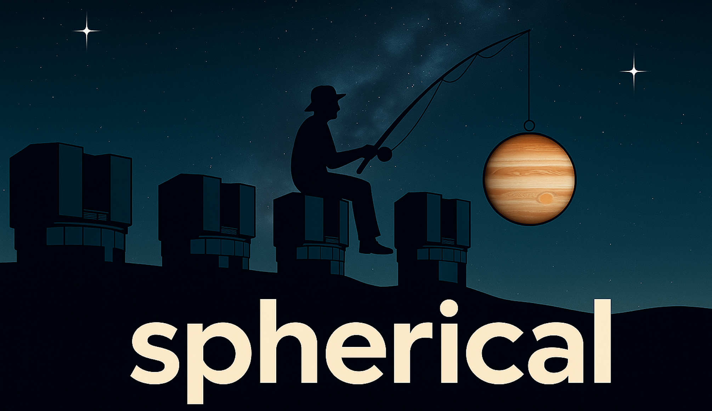

<p align="center">
  
</p>

# spherical: VLT/SPHERE Observation Database and IFS + IRDIS Data Analysis Pipeline

[](https://github.com/m-samland/spherical)
[](https://opensource.org/licenses/BSD-3-Clause)
[](https://github.com/m-samland/spherical/actions/workflows/ci.yml)
[](https://doi.org/10.48550/arXiv.2509.08044)

**spherical** provides tools for exploring and analyzing data from the ESO VLT/SPHERE instrument, with a focus on high-contrast imaging observations using **IRDIS** and **IFS**.

---

## Overview

**spherical** provides a **curated observation database** for VLT/SPHERE, constructed by parsing headers from all available SPHERE data in the ESO archive and cross-matching with external catalogs. This database systematically identifies SPHERE observation sequences and summarizes observing modes, target properties, integration times, and observing conditions. Pre-built database tables are available for download from [Zenodo](https://doi.org/10.5281/zenodo.15147730) and can be updated with newer data using **spherical** itself (see [Database Tables](#database-tables)).

From exploration to execution, you can filter sequences of interest and feed them into **end-to-end reduction pipelines for both IFS and IRDIS dual-band imaging (DBI)**. Both automate the same chain — discovery, download, calibration, pre-processing, post-processing, and photometric/astrometric characterization of detected companions — behind one configuration model and one entry point. Polarimetric (DPI) and sparse-aperture-masking observations are covered by the database for discovery and download, but are not reduced by the pipeline.

> ⚠️ **Note:** The database contains **metadata only**. It does **not** include already reduced data products.

---

## Usage Model

**spherical** is both:

1. **A curated observation database** — metadata about VLT/SPHERE observations in the ESO archive (not the reduced data).
2. **Python-based IFS and IRDIS reduction and analysis pipelines** — intended to be run from a **Python script** so that you can tune parameters and control each step.

You can use **spherical** in two complementary ways:

- **As a library**  
  Import in Python or Jupyter to query/filter the database and to call pipeline components programmatically.

- **As a script-driven workflow**  
  Start from the provided example scripts (`ifs_reduction_template.py`, `irdis_reduction_template.py`) to configure and run a complete reduction with sensible defaults and many tunable parameters.

There is deliberately **no command-line interface** for the reductions. Configuration is a set of typed Python dataclasses (`IFSReductionConfig` / `IRDISReductionConfig`) passed to `execute_targets()`, which dispatches on the instrument of each observation. Both pipelines **resume by default**: enabled steps whose outputs already exist on disk are skipped, so growing a target list is cheap. Recomputation is opt-in via `steps.force`.

---

## Key Features

- **Comprehensive Database**  
  Auto-generated by parsing all SPHERE headers and cross-referencing with Gaia and other databases to improve completeness and accuracy.

- **Flexible Data Exploration**  
  Identify observations using custom filters (target properties, observing mode, conditions, integration time, etc.).

- **End-to-End IFS Pipeline**  
  Automates:
  - Data discovery and **download** from the ESO archive
  - Spectral cube extraction using the adapted **CHARIS** pipeline ([Samland et al. 2022](https://ui.adsabs.harvard.edu/abs/2022A%26A...668A..84S/abstract))
  - Astrometric and photometric calibration with **A. Vigan’s SPHERE tools** ([repository](https://github.com/avigan/SPHERE))
  - Post-processing with the **TRAP** algorithm ([Samland et al. 2021](https://ui.adsabs.harvard.edu/abs/2017AJ....154....7G/abstract))
  - Automatic detection and extraction of exoplanet **contrast spectra**

- **End-to-End IRDIS Pipeline (dual-band imaging)**  
  Mirrors the IFS workflow, step for step:
  - Data discovery and **download** from the ESO archive
  - Per-observation **master calibrations** — background, DIT-resolved flat, and bad-pixel map
  - **Pre-processing** into calibrated `converted/` cubes with analytic inverse-variance maps
  - **Astrometric and photometric calibration** from the satellite-spot (waffle) CENTER frames and the unocculted FLUX PSF, including DMS-offset propagation for dithered sequences
  - Post-processing with **TRAP**, including spectral template matching across the two DBI channels
  - Automatic **detection, photometry, and astrometry** of companion candidates, with per-detection uncertainties

  The IRDIS reduction draws partly on **A. Vigan’s SPHERE pipeline** ([repository](https://github.com/avigan/SPHERE)), partly on the earlier `simplified_IRDIS_reduction` module in this package, and is partly new. It has been **validated against the published photometry and astrometry of 51 Eridani b**.

- **Other IRDIS modes**  
  Database discovery and download for **polarimetric (DPI)**, broadband, narrow-band, and **sparse-aperture-masking** observations. The reduction pipeline is designed and validated for **DBI**; polarimetric and SAM sequences are not reduced. Single-channel photometric modes (broadband, narrow-band) are not blocked and TRAP falls back to its contrast-curve and candidate-extraction path — spectral template matching is degenerate with one channel — but these modes are untested.

---

## Installation

**Python ≥ 3.11** is required.

### Option A: Using pip

We recommend a dedicated environment (e.g., via Miniconda or Micromamba):

```bash
mamba create -n spherical_env python=3.13
mamba activate spherical_env
```

**Base install (database exploration only):**

```bash
pip install git+https://github.com/m-samland/spherical.git
```

**Full pipeline (IFS + IRDIS reduction):**

```bash
pip install "spherical[pipeline] @ git+https://github.com/m-samland/spherical.git"
```

**For development (editable install):**

```bash
git clone https://github.com/m-samland/spherical.git
cd spherical
pip install -e ".[pipeline,notebook,test]"
```

### Option B: Using Pixi

[Pixi](https://pixi.sh) manages both conda and pip dependencies automatically — no need to create a separate environment.

```bash
git clone https://github.com/m-samland/spherical.git
cd spherical
```

**Base install (database exploration only):**

```bash
pixi install
```

**Full pipeline (IFS + IRDIS reduction):**

```bash
pixi install -e pipeline
```

**Full development environment (pipeline + notebooks + tests):**

```bash
pixi install -e dev
pixi shell -e dev
```

> **Note:** The `dev` environment installs `charis` and `trap` in editable mode from
> local sibling directories `../charis-dep/` and `../trap/`, so those repositories must be
> cloned next to `spherical` first. If you only want to work on `spherical` itself, use
> `pixi install -e dev-git` instead, which pulls `charis`/`trap` from git.

---

## Database Tables

**spherical** requires database tables containing SPHERE observation metadata. You have three options:

1. **Download pre-built tables (recommended)**  
   Fetch the latest published tables from Zenodo:

   ```bash
   spherical-sync-tables --dest ~/data/sphere/database
   ```

   Downloads are md5-verified and resumable. Locally updated or regenerated tables are not overwritten unless you pass `--force`; use `--list` or `--dry-run` to see what would be fetched.

   Add `--include-polarimetry` for the IRDIS polarimetry tables and `--include-sam` for the sparse-aperture-masking ones. Target tables and `database_provenance.json` are fetched automatically when the record offers them.

2. **Extend the tables to today yourself**  
   The published tables end at their release date. To bring them up to date against the ESO archive:

   ```bash
   # 1. Start from the latest pre-built tables
   spherical-sync-tables --dest ~/data/sphere/database

   # 2. Extend the file table to today and rebuild the target/observation
   #    tables for every mode (including SAM), then run Gaia DR3 and MOCAdb
   #    enrichment and write database_provenance.json
   spherical-update-database --dest ~/data/sphere/database
   ```

   To re-run only the Gaia/MOCA enrichment on existing tables — after a catalog update, or if enrichment previously failed — without querying ESO:

   ```bash
   spherical-update-database --dest ~/data/sphere/database --enrich-only [--mode irdis]
   ```

   The command reports a per-mode enrichment health summary and exits non-zero if an enrichment failed or degraded noticeably relative to the previous run. The library equivalents are shown in `examples/generate_database.py`.

3. **Manually download pre-built tables**  
   Download from Zenodo: [10.5281/zenodo.15147730](https://doi.org/10.5281/zenodo.15147730).  
   At minimum you need **`table_of_files`** and **`table_of_observations`** for your chosen instrument (**IFS** and/or **IRDIS**). The record also carries a **`table_of_targets`** per mode — one row per unique target, and the input `--enrich-only` re-enriches — plus **`database_provenance.json`**, which records how each table was built. Place them where your scripts can access them.

### Telling spherical where the tables are

All entry points read the tables from one directory. Set **`$SPHERICAL_DATABASE_DIR`** once and none of them need to be told again:

```bash
export SPHERICAL_DATABASE_DIR=~/data/sphere/database   # add to ~/.bashrc or ~/.zshrc
```

It is consumed by:

| Entry point | Without the variable |
|---|---|
| `spherical-sync-tables`, `spherical-update-database` | `--dest` is required |
| `plot_trap_mosaics` | falls back to `--database-dir`; without either, titles omit exposure-time and rotation metadata |
| `examples/{ifs,irdis}_reduction_template.py` | fall back to `~/data/sphere/database` |

An explicit command-line flag always wins over the variable, so a one-off run against a different copy of the tables needs no unsetting. In your own scripts, `spherical.database.paths.resolve_database_dir(explicit=None, default=None)` applies the same precedence.

---

## Quick Start

1. **Explore observations**  
   After obtaining the [database tables](#database-tables), launch the Jupyter notebook `examples/explore_database.ipynb` to browse and filter available observations.

2. **Run a reduction (script-driven)**  
   The pipelines are designed to be run from a Python script so you can tune parameters. Start from the matching template, adjust the configuration, then run it:

   ```bash
   python examples/ifs_reduction_template.py     # IFS
   python examples/irdis_reduction_template.py   # IRDIS dual-band imaging
   ```

   Both templates select observations from the database, then hand them to `execute_targets()`. The two configurations share the download, resume/force, TRAP, and resource sub-configs, so the templates read almost identically.

3. **Visualize the results**  
   `plot_trap_mosaics` renders per-template detection-map and spectrum mosaics for a whole TRAP results tree (see [Scripts](#scripts)).

4. **(Optional) Update the database**  
   See [Database Tables](#database-tables) for how to refresh the tables with newer ESO data using `examples/generate_database.py`.

> More detailed documentation is planned for future releases. In the meantime, the example scripts and notebooks in the `examples/` folder are the best starting points.

---

## Scripts

When you install **spherical**, a small set of **helper command-line scripts** are installed and added to your `$PATH`.  
These **do not** run the reductions themselves. Instead, they help **monitor, summarize, and visualize** pipeline runs you executed via Python scripts. All three cover IFS and IRDIS alike — just point them at the right reduction path:

- **Crash-report aggregator (`crash_reports`)**  
  Collects crash reports from all reductions below a directory into a single summary, grouped by instrument and pipeline (reduction vs. TRAP), with an exception-frequency tally.

- **Reduction-status summary (`reduction_status`)**  
  Reports how far each dataset got and whether it completed, for both the reduction and the TRAP post-processing.

- **TRAP result mosaics (`plot_trap_mosaics`)**  
  Renders per-template detection-map and spectrum mosaics for a whole TRAP results tree as PDF or PNG, optionally annotated with exposure time and field rotation from the observation table.

### Usage Examples

```bash
# Crash report summary
crash_reports /path/to/reductions [--csv crashes.csv] [--top N] \
    [--instrument {ifs,irdis,all}]

# Reduction status summary
reduction_status /path/to/reductions [--csv summary.csv] \
    [--instrument {ifs,irdis,all}] [--pipeline {reduction,trap,all}]

# Detection + spectrum mosaics for an IRDIS TRAP results tree
plot_trap_mosaics /path/to/reductions/IRDIS/trap --database-dir ~/data/sphere/database
```

`plot_trap_mosaics` infers which observation table to read from the `IFS`/`IRDIS` segment of the results path; pass `--instrument` to state it explicitly. Its `--database-dir` can be omitted entirely if [`$SPHERICAL_DATABASE_DIR`](#telling-spherical-where-the-tables-are) is set.

> Run any script with `--help` to see its options.

---

## Testing

**Database testing**  
The database-generation logic is covered by unit tests executed via GitHub Actions (see CI badge above).

**Pipeline testing**  
Because the reductions are computationally intensive and operate on large files, we do not run them in CI. To test locally:

1. Install the **full pipeline** (see [Installation](#installation)).
2. Obtain a **small test dataset** (from the ESO archive or your own subset).
3. Run the matching example reduction:

   ```bash
   python examples/ifs_reduction_template.py
   python examples/irdis_reduction_template.py
   ```

4. Inspect the outputs (logs, intermediate products, and final results).

**Astrometry regression tests**  
`tests/test_51eri_astrometry_regression.py` and `tests/test_51eri_ifs_astrometry_regression.py` pin the companion position that the IRDIS and IFS pipelines report for the 2015-09-24 51 Eridani sequences against frozen baselines, and check agreement with the published GRAVITY position. They need the reduced data on disk and are therefore opt-in:

```bash
pytest -m regression
```

> We plan to provide a minimal public test dataset in a future release to simplify local testing.

---

## Contributing

Contributions are welcome! To set up a development environment:

```bash
git clone https://github.com/m-samland/spherical.git
cd spherical

# Using pip:
pip install -e ".[pipeline,notebook,test]"

# Or using Pixi:
pixi install -e dev
pixi shell -e dev
```

**Guidelines**

- Use **feature branches or forks** for new work.
- Please use the provided **issue** and **pull request** templates.
- Run the linter before submitting a PR:

  ```bash
  ruff check src/
  # Or with Pixi:
  pixi run -e dev lint
  ```

New to open source? Feel free to [open an issue](https://github.com/m-samland/spherical/issues) for questions, or reach out to [@m-samland](https://github.com/m-samland).

---

## Citation and Attribution

If **spherical** supports your research, please cite:

- **spherical:** [Samland et al. (2025)](https://ui.adsabs.harvard.edu/abs/2025arXiv250908044S/abstract)
- **IFS pipeline:** [Samland et al. (2022)](https://ui.adsabs.harvard.edu/abs/2022A%26A...668A..84S/abstract)  
- **TRAP post-processing:** [Samland et al. (2021)](https://ui.adsabs.harvard.edu/abs/2017AJ....154....7G/abstract)  
- **Species package (spectral calibration):** [Stolker et al. (2020)](https://ui.adsabs.harvard.edu/abs/2020A%26A...635A.182S/abstract)

The astrometric and photometric calibration of both pipelines, and parts of the IRDIS reduction, build on **A. Vigan's SPHERE tools** ([repository](https://github.com/avigan/SPHERE), [Vigan 2020](https://ui.adsabs.harvard.edu/abs/2020ascl.soft09002V/abstract)) — please acknowledge it as well.

Research that has used **spherical**:

- [Franson et al. (2023)](https://ui.adsabs.harvard.edu/abs/2023AJ....165...39F/abstract)

---

## License

This project is licensed under the [BSD-3-Clause License](https://opensource.org/licenses/BSD-3-Clause).

---
